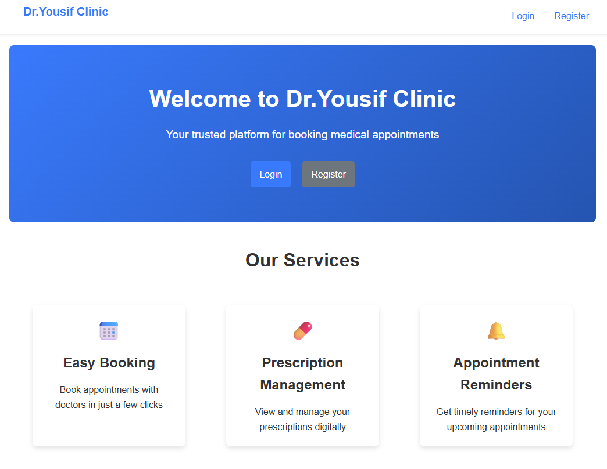
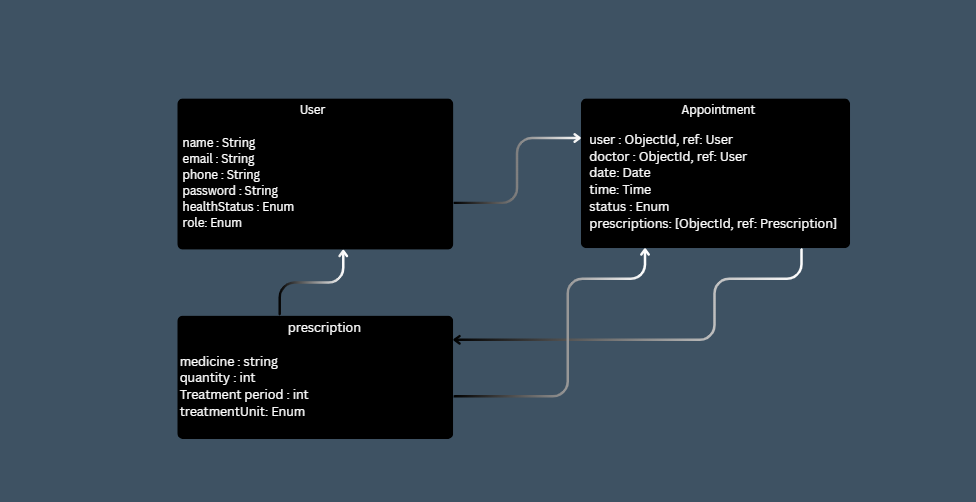

[#FRONT END](#font-end)

[#Clinic_Appointment_Front](https://github.com/thaistrok/Clinic_Appointment_Front)

[#BACK END](#back-end)

[#clinic_appointment_server](https://github.com/thaistrok/clinic_appointment_server)

# back-end🔧
- [🎨 Front End](#front-end)

# Deployed link:
[Clinic_Appointment](https://crooked-rainstorm.surge.sh)


# Render deploed Link:
[clinic_appointment_server](https://clinic-appointment-server.onrender.com)


# Clinic Appointment System - Backend Server

A full-stack web application built with the MERN stack (MongoDB, Express.js, React.js, Node.js) for a clinic appointment management system. It enables patients and staff to securely register, authenticate, and manage medical appointments. The app features a responsive, user-friendly interface with intuitive navigation and real-time updates to enhance accessibility and efficiency. Users can book, view, reschedule, or cancel appointments, receive email notifications, manage patient profiles, and handle prescriptions and medications. JWT-based authentication ensures secure access to role-based features, while MongoDB handles all CRUD operations for users, appointments, and medical records—delivering scalable, reliable performance across devices.

## User Story

As a patient, I want to be able to book appointments with doctors online so that I can easily schedule medical consultations without having to call the clinic during business hours.

As a doctor, I want to view and manage my appointments so that I can efficiently organize my schedule and provide better care to my patients.

As an administrator, I want to oversee all appointments and user accounts so that I can ensure the system runs smoothly and securely.

## Features

- User authentication and authorization (JWT-based)
- Role-based access control (patient, doctor, admin)
- Appointment scheduling and management
- Prescription creation and management
- Medication database
- User profile management
- RESTful API design
- Input validation and error handling

## Technology Stack

- **Node.js** - JavaScript runtime environment
- **Express.js** - Web application framework
- **MongoDB** - NoSQL database
- **Mongoose** - Object Data Modeling (ODM) library
- **JSON Web Tokens (JWT)** - Authentication and authorization
- **Bcrypt** - Password hashing
- **Dotenv** - Environment variable management
- **Cors** - Cross-Origin Resource Sharing handling
- **Morgan** - HTTP request logging

## Prerequisites

Before you begin, ensure you have the following installed:
- Node.js (v14 or higher)
- npm (v6 or higher) or yarn
- MongoDB database (local or cloud instance)

## Installation

1. Clone the repository:
   ```bash
   git clone <repository-url>
   cd clinic_appointment_server
   ```

2. Install dependencies:
   ```bash
   npm install
   ```

3. Create a `.env` file in the root directory with the following variables:
   ```env
   MONGO_URI=your_mongodb_connection_string
   JWT_SECRET=your_jwt_secret_key
   PORT=5000
   JWT_EXPIRE=1h
   ```

4. Start the development server:
   ```bash
   npm run dev
   ```

   Or for production:
   ```bash
   npm start
   ```

## Configuration

The application requires the following environment variables:

| Variable | Description | Default |
|----------|-------------|---------|
| `MONGO_URI` | MongoDB connection string | None (required) |
| `JWT_SECRET` | Secret key for JWT token generation | None (required) |
| `PORT` | Server port | 5000 |
| `JWT_EXPIRE` | JWT token expiration time | 1h |

## API Endpoints

### Authentication
- `POST /api/auth/register` - Register a new user
- `POST /api/auth/login` - Login user
- `GET /api/auth/profile` - Get user profile
- `PUT /api/auth/password` - Update user password

### Users
- `GET /api/users` - Get all users (admin only)
- `GET /api/users/doctors` - Get all doctors
- `POST /api/users/doctor` - Add a new doctor (admin only)
- `GET /api/users/appointments` - Get appointments for current user
- `GET /api/users/:id` - Get user by ID
- `PUT /api/users/:id` - Update user
- `DELETE /api/users/:id` - Delete user (admin only)

### Appointments
- `POST /api/appointments` - Create a new appointment
- `GET /api/appointments` - Get all appointments (admin only)
- `GET /api/appointments/my` - Get appointments for current user
- `GET /api/appointments/:id` - Get appointment by ID
- `PUT /api/appointments/:id` - Update appointment
- `DELETE /api/appointments/:id` - Delete appointment

### Prescriptions
- `GET /api/prescriptions` - Get all prescriptions
- `GET /api/prescriptions/:id` - Get prescription by ID
- `POST /api/prescriptions` - Create a new prescription (doctor/admin only)
- `PUT /api/prescriptions/:id` - Update prescription (doctor/admin only)
- `DELETE /api/prescriptions/:id` - Delete prescription (doctor/admin only)

### Medications
- `GET /api/medications` - Get all medications
- `GET /api/medications/:id` - Get medication by ID
- `POST /api/medications` - Create a new medication
- `PUT /api/medications/:id` - Update medication
- `DELETE /api/medications/:id` - Delete medication

## Project Structure

```
clinic_appointment_server/
├── controllers/          # Request handlers
├── db/                  # Database connection
├── middleware/          # Authentication and authorization
├── models/              # Database models
├── routes/              # API route definitions
├── .env                 # Environment variables
├── server.js            # Application entry point
├── package.json         # Project dependencies and scripts
└── README.md            # This file
```

## Data Models

### User
- `name` (String) - User's full name
- `email` (String) - Unique email address
- `password` (String) - Hashed password
- `role` (String) - User role (patient/doctor/admin)
- `specialty` (String) - Doctor's specialty (for doctors)
- `experience` (String) - Doctor's experience (for doctors)

### Appointment
- `patient` (ObjectId) - Reference to User (patient)
- `doctor` (ObjectId) - Reference to User (doctor)
- `date` (Date) - Appointment date
- `time` (String) - Appointment time
- `status` (String) - Appointment status (scheduled/confirmed/completed/cancelled)
- `reason` (String) - Reason for appointment
- `notes` (String) - Additional notes
- `duration` (Number) - Duration in minutes (default: 30)
- `isEmergency` (Boolean) - Emergency appointment flag

### Prescription
- `appointment` (ObjectId) - Reference to Appointment
- `doctor` (ObjectId) - Reference to User (doctor)
- `patient` (ObjectId) - Reference to User (patient)
- `medications` (Array) - List of prescribed medications
- `diagnosis` (String) - Medical diagnosis

### Medication
- `name` (String) - Medication name
- `dosage` (String) - Dosage information
- `frequency` (String) - How often to take the medication

## Authentication & Authorization

The API uses JWT (JSON Web Tokens) for authentication. Users must include a valid JWT token in the Authorization header of their requests:

```
Authorization: Bearer <your-jwt-token>
```

Role-based access control is implemented:
- **Admin**: Full access to all resources
- **Doctor**: Can manage appointments and prescriptions for their patients
- **Patient**: Can view and manage their own appointments and prescriptions

## Contributing

1. Fork the repository
2. Create your feature branch (`git checkout -b feature/AmazingFeature`)
3. Commit your changes (`git commit -m 'Add some AmazingFeature'`)
4. Push to the branch (`git push origin feature/AmazingFeature`)
5. Open a pull request

## License

This project is licensed under the MIT License - see the [LICENSE](LICENSE) file for details.

## Health Check

A health check endpoint is available at:
- `GET /api/health` - Server status and timestamp

## Development

For development with auto-restart:
```bash
npm run dev
```

This uses nodemon to automatically restart the server when code changes are detected.


# back-end🔧
- [🎨 Front End](#front-end)

# Clinic Appointment System - Frontend

A full-stack web application built with the MERN stack (MongoDB, Express.js, React.js, Node.js) for a clinic appointment management system. It enables patients and staff to securely register, authenticate, and manage medical appointments. The app features a responsive, user-friendly interface with intuitive navigation and real-time updates to enhance accessibility and efficiency. Users can book, view, reschedule, or cancel appointments, receive email notifications, manage patient profiles, and handle prescriptions and medications. JWT-based authentication ensures secure access to role-based features, while MongoDB handles all CRUD operations for users, appointments, and medical records—delivering scalable, reliable performance across devices.

## Technology Stack

- **Framework**: [React 19](https://reactjs.org/)
- **Build Tool**: [Vite](https://vitejs.dev/)
- **Routing**: [React Router v7](https://reactrouter.com/)
- **HTTP Client**: [Axios](https://axios-http.com/)
- **Styling**: CSS Modules
- **Development**: [@vitejs/plugin-react-swc](https://github.com/vitejs/vite-plugin-react-swc)

## Prerequisites

- [Node.js](https://nodejs.org/) (version 14 or higher)
- [npm](https://www.npmjs.com/) (comes with Node.js) or [yarn](https://yarnpkg.com/)

## Installation Instructions

1. Clone the repository:
   ```bash
   git clone <repository-url>
   ```

2. Navigate to the frontend directory:
   ```bash
   cd FrontEnd
   ```

3. Install dependencies:
   ```bash
   npm install
   # or
   yarn install
   ```

## Usage

### Development Server

To start the development server with hot module replacement:

```bash
npm run dev
# or
yarn dev
```

The application will be available at `http://localhost:5173` by default.

### Production Build

To create a production build:

```bash
npm run build
# or
yarn build
```

### Preview Production Build

To preview the production build locally:

```bash
npm run preview
# or
yarn preview
```

## Project Structure

```
FrontEnd/
    public/                 # Static assets
    src/
        assets/             # Images and other assets
        components/         # Reusable UI components
        hooks/              # Custom React hooks
        pages/              # Page components
        services/           # API services and utilities
        styles/             # CSS stylesheets
        App.jsx             # Main application component
        main.jsx            # Application entry point
    index.html              # HTML template
    package.json            # Project dependencies and scripts
    vite.config.js          # Vite configuration
```

### Key Directories

- **components/**: Contains reusable UI components like forms, lists, navigation, and authentication components
- **pages/**: Contains page-level components that correspond to routes in the application
- **services/**: Contains API service files for communicating with the backend and utility functions
- **hooks/**: Contains custom React hooks for shared logic
- **styles/**: Contains CSS files for styling components and pages

## Available Scripts

- `npm run dev` - Starts the development server
- `npm run build` - Creates a production build
- `npm run preview` - Previews the production build locally

## Application Features

- **User Authentication**: Login and registration functionality with role-based access control
- **Appointment Management**: Create, view, edit, and delete appointments
- **Prescription Management**: Create and view prescriptions linked to appointments
- **User Profiles**: Manage user information and update passwords
- **Role-based Dashboards**: Separate dashboards for patients and doctors

## Contributing Guidelines

1. Fork the repository
2. Create a feature branch (`git checkout -b feature/AmazingFeature`)
3. Make your changes
4. Commit your changes (`git commit -m 'Add some AmazingFeature'`)
5. Push to the branch (`git push origin feature/AmazingFeature`)
6. Open a pull request